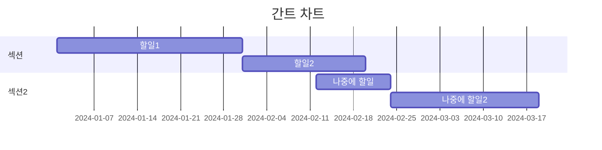

---

---
엘리베이터 권상기(모터)와 감속기 등 기계실 장비에서 발생하는 소음과 진동이 건물 내부로 전달되는 것을 차단하기 위해 설치하는 방음 장치

![[Pasted image 20260804165906.png]]

---

```mermaid
gantt
	title 간트 차트
	dateFormat YYYY-MM-DD
	section 섹션
		할일1 :a1, 2024-01-01, 30d
		할일2 :after a1, 20d
	section 섹션2
		나중에 할일 :2024-02-12, 12d
		나중에 할일2 :24d
```

